# Boathouse-ETL System Architecture

*Last Updated: October 16, 2025*

## Overview

Boathouse-ETL serves as the **central data management and authentication hub** for the rowing club ecosystem. It acts as the critical middleware layer between external data sources (Google Sheets) and user-facing applications (Rowcalibur, Crewssignment), providing a unified PostgreSQL database with comprehensive ETL capabilities and secure authentication services.

## System Role & Position

Boathouse-ETL functions as the **data backbone** of the rowing club's digital infrastructure:

- **Data Integration Layer**: Extracts, transforms, and loads data from Google Sheets into a centralized PostgreSQL database
- **Authentication Service**: Provides secure PIN-based authentication for athletes across all applications
- **API Gateway**: Serves as the primary data access point for external applications
- **Data Consistency Manager**: Ensures data integrity and standardization across all systems

## Architecture Components

### 1. ETL Pipeline System

#### Data Sources
- **Google Sheets Integration**: Automated extraction from club spreadsheets
- **Multiple Sheet Types**: Athletes, Boats, Teams, Practice Sessions, Attendance, Lineups, USRA Categories

#### ETL Process Flow
```
Google Sheets → Extract → Transform → Validate → Load → PostgreSQL Database
```

#### ETL Orchestrator
- **Sequential Processing**: Maintains data dependencies (Boats → USRA Categories → Athletes → Teams → Practice Sessions → Attendance → Lineups)
- **Batch Processing**: Configurable batch sizes for optimal performance
- **Error Handling**: Comprehensive retry logic and error reporting
- **Dry Run Mode**: Testing capabilities without database changes

### 2. Database Schema

#### Core Entities
- **Athletes**: Complete athlete profiles with authentication, competitive status, and personal information
- **Teams**: Team definitions and compositions
- **Boats**: Boat inventory with standardized type notation (1x, 2x, 2-, 4x, 4+, 8+)
- **Practice Sessions**: Session scheduling and management
- **Attendance**: Practice attendance tracking
- **Lineups**: Detailed lineup management with seat assignments
- **USRA Categories**: Age and weight category classifications

#### Competitive Systems (Rowcalibur Integration)
- **Gauntlet System**: Individual athlete challenges and rankings
- **Ladder System**: Position-based competitive rankings
- **Match Records**: Detailed match history and statistics
- **Seat Assignments**: Competitive lineup management

#### Data Management
- **ETL Job Tracking**: Complete audit trail of data synchronization
- **Mailing Lists**: Communication management
- **Regattas & Races**: Competition tracking and results
- **Erg Tests**: Performance measurement data

### 3. Authentication Service

#### Security Features
- **PIN-Based Authentication**: Secure 4-digit PIN system for athletes
- **JWT Tokens**: Stateless authentication with configurable expiration
- **Rate Limiting**: Protection against brute force attacks
- **Account Lockout**: Automatic lockout after failed attempts
- **PIN Reset Capabilities**: Secure PIN change functionality

#### API Endpoints
- `POST /auth/login` - Athlete authentication
- `POST /auth/change-pin` - PIN modification
- `POST /auth/verify` - Token validation
- `GET /auth/athletes` - Athlete data retrieval
- `GET /auth/health` - Service health check

### 4. Data Flow Architecture

#### Input Data Flow
```
Google Sheets (Source Data)
    ↓
ETL Pipeline (Extract, Transform, Load)
    ↓
PostgreSQL Database (Centralized Storage)
    ↓
Authentication Service (Secure Access)
    ↓
External Applications (Rowcalibur, Crewssignment)
```

#### Real-time Data Access
```
External Apps → Authentication Service → Database → Structured Response
```

## Integration Points

### With Rowcalibur
- **Athlete Data**: Complete athlete profiles and competitive status
- **Gauntlet System**: Individual challenge rankings and match history
- **Ladder System**: Position-based competitive rankings
- **Boat Management**: Boat inventory and lineup assignments
- **Authentication**: Secure PIN-based login system

### With Crewssignment
- **Team Management**: Team compositions and member assignments
- **Practice Sessions**: Session scheduling and attendance tracking
- **Lineup Management**: Detailed seat assignments and boat configurations
- **Athlete Profiles**: Complete athlete information for assignment decisions

### With Google Sheets
- **Automated Sync**: Scheduled ETL jobs for data synchronization
- **Data Validation**: Comprehensive data quality checks
- **Error Reporting**: Detailed error logs and status reporting
- **Incremental Updates**: Efficient data processing for large datasets

## Technology Stack

### Backend Infrastructure
- **Runtime**: Node.js with TypeScript
- **Database**: PostgreSQL with Sequelize ORM
- **Authentication**: JWT with bcrypt password hashing
- **API Framework**: Express.js with CORS and rate limiting
- **ETL Engine**: Custom pipeline with Google Sheets API integration

### External Integrations
- **Google Sheets API**: Data extraction and synchronization
- **PostgreSQL**: Primary data storage and management
- **JWT**: Stateless authentication tokens
- **bcrypt**: Secure password hashing

### Development & Deployment
- **Migration System**: Sequelize migrations with rollback capabilities
- **Environment Management**: Comprehensive configuration system
- **Logging**: Winston-based logging with multiple levels
- **Error Handling**: Global error handling with detailed reporting

## Data Security & Privacy

### Authentication Security
- **PIN Encryption**: bcrypt hashing with salt
- **Rate Limiting**: 100 requests per 15 minutes per IP
- **Account Lockout**: Automatic lockout after failed attempts
- **JWT Expiration**: Configurable token lifetime
- **CORS Protection**: Configurable origin restrictions

### Data Protection
- **Input Validation**: Comprehensive data validation and sanitization
- **SQL Injection Prevention**: Sequelize ORM with parameterized queries
- **Error Information**: Sanitized error messages in production
- **Audit Logging**: Complete authentication and data access logs

## Scalability & Performance

### ETL Performance
- **Batch Processing**: Configurable batch sizes (default: 50 records)
- **Retry Logic**: Configurable retry attempts with exponential backoff
- **Connection Pooling**: Efficient database connection management
- **Memory Management**: Proper cleanup and resource management

### API Performance
- **Rate Limiting**: Prevents system overload
- **Connection Pooling**: Efficient database connections
- **Response Caching**: JWT-based stateless authentication
- **Error Handling**: Graceful degradation and recovery

## Monitoring & Maintenance

### Health Monitoring
- **Health Check Endpoints**: Service status monitoring
- **ETL Status Tracking**: Complete job execution monitoring
- **Database Connection Monitoring**: Connection health verification
- **Authentication Metrics**: Login success/failure tracking

### Maintenance Operations
- **Database Migrations**: Version-controlled schema changes
- **ETL Job Management**: Manual and scheduled job execution
- **Data Validation**: Comprehensive data quality checks
- **Backup & Recovery**: Data integrity and recovery mechanisms

## Future Integration Considerations

### API Expansion
- **RESTful API**: Standardized endpoints for all data access
- **GraphQL Support**: Flexible query capabilities
- **Webhook Integration**: Real-time data synchronization
- **Bulk Operations**: Efficient batch data operations

### Enhanced Security
- **OAuth Integration**: Third-party authentication support
- **Role-Based Access**: Granular permission management
- **API Versioning**: Backward compatibility management
- **Audit Trails**: Comprehensive access logging

## System Architecture Diagram

```mermaid
graph TB
    %% External Data Sources
    GS[Google Sheets<br/>📊 Club Data]
    
    %% Boathouse-ETL Core
    subgraph BHE[Boathouse-ETL System]
        ETL[ETL Pipeline<br/>🔄 Extract, Transform, Load]
        AUTH[Authentication Service<br/>🔐 PIN-based Auth]
        API[API Gateway<br/>🌐 REST Endpoints]
        ORCH[ETL Orchestrator<br/>⚙️ Process Management]
    end
    
    %% Database
    DB[(PostgreSQL Database<br/>🗄️ Centralized Storage)]
    
    %% User Applications
    RC[Rowcalibur<br/>🏆 Competitive System]
    CA[Crewssignment<br/>👥 Team Management]
    
    %% Data Flow - ETL
    GS -->|Extract Data| ETL
    ETL -->|Transform & Validate| ORCH
    ORCH -->|Load Data| DB
    
    %% Data Flow - API Access
    RC -->|Authenticate| AUTH
    CA -->|Authenticate| AUTH
    AUTH -->|JWT Token| API
    API -->|Query Data| DB
    DB -->|Structured Response| API
    API -->|Data Response| RC
    API -->|Data Response| CA
    
    %% ETL Process Details
    subgraph ETL_DETAILS[ETL Process Flow]
        EXTRACT[Extract<br/>Google Sheets API]
        TRANSFORM[Transform<br/>Data Validation]
        LOAD[Load<br/>PostgreSQL]
        EXTRACT --> TRANSFORM --> LOAD
    end
    
    %% Database Schema
    subgraph DB_SCHEMA[Database Entities]
        ATHLETES[Athletes<br/>👤 Profiles & Auth]
        TEAMS[Teams<br/>👥 Compositions]
        BOATS[Boats<br/>🚣 Equipment]
        SESSIONS[Practice Sessions<br/>📅 Scheduling]
        ATTENDANCE[Attendance<br/>✅ Tracking]
        LINEUPS[Lineups<br/>🪑 Seat Assignments]
        GAUNTLET[Gauntlet System<br/>⚔️ Challenges]
        LADDER[Ladder System<br/>📈 Rankings]
    end
    
    DB --> DB_SCHEMA
    
    %% Styling
    classDef external fill:#e1f5fe,stroke:#01579b,stroke-width:2px
    classDef boathouse fill:#f3e5f5,stroke:#4a148c,stroke-width:2px
    classDef database fill:#e8f5e8,stroke:#1b5e20,stroke-width:2px
    classDef applications fill:#fff3e0,stroke:#e65100,stroke-width:2px
    classDef etl fill:#fce4ec,stroke:#880e4f,stroke-width:2px
    classDef schema fill:#f1f8e9,stroke:#33691e,stroke-width:2px
    
    class GS external
    class ETL,AUTH,API,ORCH boathouse
    class DB database
    class RC,CA applications
    class EXTRACT,TRANSFORM,LOAD etl
    class ATHLETES,TEAMS,BOATS,SESSIONS,ATTENDANCE,LINEUPS,GAUNTLET,LADDER schema
```



## Data Flow Summary

### 1. ETL Data Flow (Scheduled)
- **Google Sheets** → **ETL Pipeline** → **PostgreSQL Database**
- Automated data synchronization from club spreadsheets
- Comprehensive data validation and transformation
- Maintains data integrity and consistency

### 2. API Data Flow (Real-time)
- **User Applications** → **Authentication Service** → **API Gateway** → **Database**
- Secure PIN-based authentication for all requests
- JWT token-based stateless authentication
- Structured data responses for application consumption

### 3. Integration Points
- **Rowcalibur**: Competitive systems, athlete data, authentication
- **Crewssignment**: Team management, practice sessions, lineups
- **Google Sheets**: Source data extraction and synchronization

## Conclusion

Boathouse-ETL serves as the critical infrastructure component that enables the rowing club's digital transformation. By providing centralized data management, secure authentication, and reliable ETL capabilities, it creates a solid foundation for current and future applications while maintaining data consistency and security across the entire ecosystem.

The system's modular architecture and comprehensive error handling ensure reliability and maintainability, while its integration capabilities support seamless connectivity with external applications and data sources.
